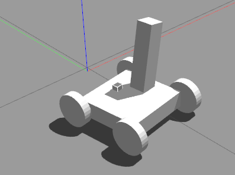

# ros2_control
To use topics to control your hardware is not enough, especially not fast enough. And it makes things much easier!

### Controller Manager
- Link Drivers and Controllers together
- Uses Resource Manager -> gathers interfaces and bring them together in a list -> put in the URDF in a ros2_control tag
- Match Controllers to hardware interfaces (yaml parameter file)
- state interfaces can be shared, command interfaces only used by one controller
1. run own node and run it in there
2. or use provided one
provides ROS Services and CLI tools to use them and nodes for key functions

### Hardware Interface
A hardware interface is the direct communication interface for ros2_control to the real hardware (or the simulated "real" hardware)

One robot might have a lot of hardware interfaces with different command and state interfaces -> you could have different types of motors and sensors on your robot

Command interfaces -> you can control position, velocity, torque
State interfaces -> to monitor the state, position, velocity, battery status, ...

### Controllers
The way we interact with the hardware. Calculate position, speed, ... and send these to the hardware interfaces
For example DiffDriveController

- there can be read-only controllers for sensors

### Installation
```sudo apt install ros-humble-ros2-control ros-humble-ros2-controllers ros-humble-gazebo-ros2-control```

Create a new workspace, copy the package to the new workspace and run the launch file after building the workspace


### Usage
The robot features the three most important types of controllers and demonstrates how to use them as simple as possible.
Features of the robot:
- Differential Drive (DiffDriveController)
- robotic arm (JointTrajectoryController)
- little cube, which can be positioned left and right(ForwardCommandController)
- publishes its joint states (JointStateBroadcaster)


##### Move the arm

```
ros2 topic pub /joint_trajectory_controller/joint_trajectory trajectory_msgs/msg/JointTrajectory "{
  header: {
    stamp: {sec: 0, nanosec: 0},
    frame_id: ''
  },
  joint_names: ['arm_joint'],
  points: [
    {
      positions: [0.2],
      velocities: [0.0],
      accelerations: [0.0],
      time_from_start: {sec: 1, nanosec: 0}
    }
  ]
}"

```

##### Move the cube

```
ros2 topic pub /position_forward_controller/commands std_msgs/msg/Float64MultiArray "{
  layout: {
    dim: [],
    data_offset: 0
  },
  data: [1.0]
}"

```

##### Move the mobile robot
0. (```sudo apt install ros-humble-rqt-robot-steering```)
1. Open ```rqt```
2. Open **Robot Tools** -> **Robot Steering** and set topic to: */diff_drive_controller/cmd_vel_unstamped*

You can also use a joypad or your keyboard to control the robot using **teleop_twist_joy** and **joy**.
